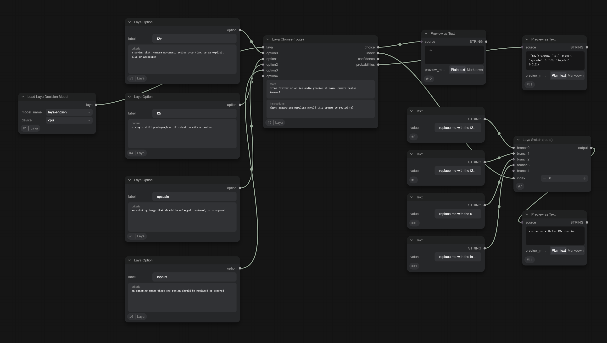

[English](README.md) | 简体中文

# ComfyUI-Laya

用 [Laya](https://huggingface.co/convaiinnovations/laya)（421M 的 System-1 决策模型）给 ComfyUI 工作流分流——让昂贵的那条分支成为唯一真正执行的分支。

Laya 不生成任何东西。你给它一段文本和几个带类型的问题，它一次前向就返回校准过的概率：GPU 上约 15ms，CPU 上约 75ms。

## 为什么要有这个

ComfyUI 一直有路由的零件——`Generate Text`、各家 API LLM 节点、`If/Else Switch`——但没有一个家用显卡上真能用的路由器。视频模型一旦占住显存，就再没有余量去养一个 7B 模型，只为回答「这条提示词要的是视频还是静图」。于是这个判断一直是手工的：你自己挑工作流、自己设步数、自己拖线。

Laya 能待在 LLM 永远待不下的位置。整个 checkpoint 磁盘上 808MB，选 `device: cpu` 时**不占显存**——它可以在 GPU 满载采样的同时做判断。这才是重点，不是那 15ms。

**这套东西不会让采样变快。** 它一行代码都没碰 UNet、采样器和 VAE。省下来的时间全部来自那条根本没跑的分支。

## 安装

```
cd ComfyUI/custom_nodes
git clone https://github.com/jtydhr88/ComfyUI-Laya.git
pip install laya
```

checkpoint 首次使用时自动下载到 `ComfyUI/models/laya/`。把你自己微调的模型放进这个目录，它就会出现在加载器的下拉里。

| checkpoint | 底座 | 参数量 | 上下文 | 说明 |
|---|---|---|---|---|
| `laya-english` | ModernBERT-large | 421M | 512 | 英文 |
| `laya-multilingual` | mmBERT-base | 322M | 1024 | 100+ 语言 |
| `laya-typed-decisions` | ModernBERT-large | 421M | 1024 | 在 Laya 自带的决策任务集上微调过 |

## 节点

全部在 `utilities/logic` 分类下。

| 节点 | 输出 |
|---|---|
| **Load Laya Decision Model** | `LAYA_MODEL`，`device` 可选 auto / cuda / cpu |
| **Laya Option** | 一条路由：`label`（名字）和 `criteria`（Laya 实际打分的判据） |
| **Laya Choose (route)** | `choice`、`index`、`confidence`、`probabilities`（JSON） |
| **Laya Switch (route)** | 放行第 `index` 条分支，**只有那一条会被求值** |
| **Laya Ask (yes/no)** | `answer`（BOOLEAN）、`probability`、`confidence` |
| **Laya Rate (score)** | `score`（各档上的期望值）、`level`、`confidence` |

## 接线

```
Laya Option ×N ──► Laya Choose ──index──► Laya Switch ──► 选中的那条流程
                              └─choice──► （标签，可预览或比较）
```



上图：四条路由各是一个 `Laya Option` 节点，一条无人机航拍的提示词以 0.95 判到 `t2v`，`Laya Switch` 放行了那条分支——另外三条流程根本没有被求值。这张图就是 `example_workflows/laya-router-demo.json`。

`Laya Choose` 的 `options` 和 `Laya Switch` 的 `branches` 都是 autogrow 输入：每把最后一个填满就自动再长一个，上限 16。`index` 按 socket 顺序走，所以第 n 个 option 对应第 n 条 branch。

只要二选一的话，用本体节点也能搭：`choice` → `Compare Text`（Equal）→ `If/Else Switch`。

## 怎么写判据

**`criteria` 才是 Laya 真正打分的文本**，`label` 只是结果里返回的那个名字。光写标签、不写判据，区分度会差很多。同一条提示词对比：

```
video: 要的是运动镜头、摄影机运动，或者一段片子   → 0.96
video                                          → 区分度差得多
```

**看 `probabilities`，别看 `confidence`。** 公开 checkpoint 自带的 temperature 超出合理范围，加载时库自己会警告。真正值得依据的信号是 top1 和 top2 之间的差距。

**优先用 `Laya Choose`，不是 `Laya Ask`。** 公开 checkpoint 在没训练过的领域上严重偏向 false，所以 0.5 这个阈值在你拿自己的样本校准之前没有意义。`Laya Choose` 取 argmax，压根不需要阈值。

**中文场景必须换 `laya-multilingual`。** 英文 checkpoint 喂中文时各选项概率几乎均匀——它不是判错，是根本没在做判断。判据本身可以继续用英文写，多语种 checkpoint 的跨语言对齐做得不错。

## 依赖

`laya>=0.3.5`（它会带上 `torch>=2.0.0`、`transformers>=4.48.0`、`huggingface_hub>=0.20.0`）。

`Laya Switch` 需要包含 [Comfy-Org/ComfyUI#16377](https://github.com/Comfy-Org/ComfyUI/pull/16377) 的 ComfyUI。在这个修复之前，`TopologicalSort.get_input_info` 是拿**未展开**的 `INPUT_TYPES()` 去查的，像 `branches.branch0` 这样的 autogrow 输入名查不到对应 spec，会被判成非惰性，于是**每条分支都会执行**——那会让路由器比不路由还慢。本机在四路图上实测过：打补丁前四条分支源全跑，打补丁后只跑一条。

## 测试

```
pytest tests
```

schema 层的测试在任何环境都能跑。execute 层的测试会在 CPU 上加载真实 checkpoint，没有就自动跳过；用环境变量 `LAYA_TEST_CHECKPOINT` 指定用哪个。

## 许可

GPL-3.0，见 `LICENSE`。Laya 权重本身是 Apache-2.0，本仓库不再分发。
